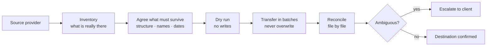

# Cloud File Migration & Organization — client case studies

`SANITIZED CLIENT CASE STUDIES`

**Project type:** Sanitized client case studies
**Evidence sources:** completed Upwork contract (5.0), completed Fiverr orders and public client reviews, published Fiverr portfolio project
**Status:** delivered

Moving file estates between cloud providers without losing their shape, and
giving the ones that stayed put a structure a team can navigate.

> No client names, folder names, file names, links, IDs or screenshots of client
> content appear anywhere in this repository.

---

## Why these jobs go wrong

Shared drives decay in a predictable way. Files land at the root because that is
where the upload dialog opens. Two people invent two folder schemes. Nobody
deletes anything, because nobody is sure what it is. Then the business changes
provider, and that mess is what gets copied across — often flattened, sometimes
renamed, and nobody notices until the file somebody needs is not where it was.

The two failure modes worth naming:

- **A migration that "succeeded" but flattened the structure.** Every byte
  arrived. The folder tree did not. Functionally, the data is lost.
- **A sync that propagates a deletion.** Someone tidies one side, the tool
  faithfully tidies the other, and the only copy is gone.

Both are avoidable, and avoiding them is most of the actual work.

---

## Architecture — the method

## Engagements

### 1. Mega → Google Drive migration — Upwork

A folder tree moved between cloud storage providers with the structure kept
intact. Contract closed at **5.0** and is listed as an Upwork Profile Highlight.

**Tools.** Mega · Google Drive

### 2. Dropbox organisation and Drive ↔ OneDrive migration — Fiverr

Repeat cloud-storage organisation and migration work delivered through Fiverr,
with client reviews recorded against that service in the account history.

**Tools.** Dropbox · Google Drive · OneDrive

### 3. Google Drive structure setup — Fiverr, 2023

Creating and setting up a Drive file structure from scratch. Three-day delivery,
5 stars.

> "Prompt attention and action to create and set up Google drive file structure."
> — client, Australia, 2023

### 4. Drive reorganisation for an owner and their team — Fiverr, 2025

A three-week engagement reorganising a shared Drive in use by a team.

> "Drive was organized and really helped me and my team out."
> — client, United States, 2025

### 5. Course content organisation — Fiverr portfolio project, November 2024

An e-learning client needed course content navigable rather than searchable: a
structured folder system plus a master navigation document. Recorded project
value $100–$200. Published as a portfolio project on Fiverr.

---

## How I work on these

1. **Inventory before anything moves.** What is actually there, and which of it is
   genuinely source rather than a copy of a copy.
2. **Agree what must survive.** Structure, names, dates, sharing — in writing,
   before the first transfer.
3. **Dry run.** No writes.
4. **Transfer in batches**, never overwriting an existing destination file.
5. **Reconcile file by file** and escalate anything ambiguous instead of deciding
   it myself.
6. **Leave the recovery path intact** until the client confirms the result.

## Implementation notes

Client folder structures, file names, item IDs and account details are
intentionally omitted because the estates they describe belong to the clients.
Where a detail is not documented here, it is left out rather than reconstructed.

## Privacy

No client names, no file or folder names, no IDs, no links, no credentials, no
screenshots of client content. Quotes are from reviews clients published
publicly; usernames are omitted.

## Related

- [gmail-business-inbox-organization](https://github.com/skmalikllc/gmail-business-inbox-organization)
- [automation-portfolio](https://github.com/skmalikllc/automation-portfolio)
