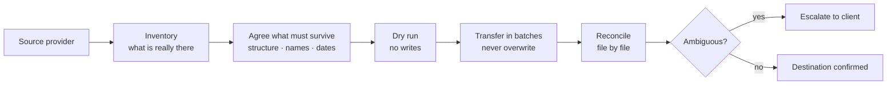

# Cloud File Migration & Organization — client case studies

`SANITIZED CLIENT CASE STUDIES`

**Project type:** Sanitized client case studies
**Evidence sources:** completed Upwork contract (5.0), completed Fiverr orders and public client reviews, published Fiverr portfolio project
**Status:** delivered

Moving file estates between cloud providers without losing their shape, and
giving the ones that stayed put a structure a team can navigate.

> No client names, folder names, file names, links, IDs or screenshots of client
> content appear anywhere in this repository.

---

## Why these jobs go wrong

Shared drives decay in a predictable way. Files land at the root because that is
where the upload dialog opens. Two people invent two folder schemes. Nobody
deletes anything, because nobody is sure what it is. Then the business changes
provider, and that mess is what gets copied across — often flattened, sometimes
renamed, and nobody notices until the file somebody needs is not where it was.

The two failure modes worth naming:

- **A migration that "succeeded" but flattened the structure.** Every byte
  arrived. The folder tree did not. Functionally, the data is lost.
- **A sync that propagates a deletion.** Someone tidies one side, the tool
  faithfully tidies the other, and the only copy is gone.

Both are avoidable, and avoiding them is most of the actual work.

---

## Architecture — the method

## Engagements

### 1. Mega → Google Drive migration — Upwork

A folder tree moved between cloud storage providers with the structure kept
intact. Contract closed at **5.0** and is listed as an Upwork Profile Highlight.

**Tools.** Mega · Google Drive

### 2. Dropbox organisation and Drive ↔ OneDrive migration — Fiverr

Repeat cloud-storage organisation and migration work delivered through Fiverr,
with client reviews recorded against that service in the account history.

**Tools.** Dropbox · Google Drive · OneDrive

### 3. Google Drive structure setup — Fiverr, 2023

Creating and setting up a Drive file structure from scratch. Three-day delivery,
5 stars.

> "Prompt attention and action to create and set up Google drive file structure."
> — client, Australia, 2023

### 4. Drive reorganisation for an owner and their team — Fiverr, 2025

A three-week engagement reorganising a shared Drive in use by a team.

> "Drive was organized and really helped me and my team out."
> — client, United States, 2025

### 5. Course content organisation — Fiverr portfolio project, November 2024

An e-learning client needed course content navigable rather than searchable: a
structured folder system plus a master navigation document. Recorded project
value $100–$200. Published as a portfolio project on Fiverr.

---

## One-way mirror and continuous sync — engagement type

`ONGOING ENGAGEMENT · METHOD ONLY`

A migration ends. A **mirror** does not — and that changes the whole risk profile.
This is the one class of file work where the dangerous operation is not the copy,
it is the delete.

I am currently engaged on work of this kind between two major cloud platforms.
**It is ongoing rather than delivered, so there is no case study here** — only the
control rules the work is run under. No client, platform-account, volume or
content detail appears below, and none will.

**The problem.** A business keeps its files in one platform but needs them
readable in another — for reporting, for a team that lives in different tooling,
or as a second copy. The naive answer is a two-way sync, and it is the wrong one:
two-way means an accidental deletion or an overwrite on either side propagates
everywhere, and the "backup" destroys the thing it was protecting.

**The control rules.**

1. **One side is the master, in writing, before anything runs.** The other is a
   mirror. Not "mostly", and not decided per folder later.
2. **Deletion propagation is off.** A file removed on the master must not vanish
   from the mirror on its own. Reclaiming space is a separate, deliberate,
   reviewed action.
3. **Direction is explicit and re-checked.** A sync job built for one direction
   cannot simply be restarted when the business decides the other side is now
   authoritative — that is a new job, re-validated from scratch.
4. **Existing destination files are never overwritten.** Where both sides hold a
   file of the same name at different sizes or times, it is held for a human to
   decide which is authoritative. Same-name is not sameness.
5. **Pilot before rollout**, on a scope small enough that being wrong is cheap.
6. **The recovery path stays intact** — nothing is emptied or purged while any
   version question is still open.
7. **Permission boundaries are respected, not recreated.** A sync tool that can
   create folders can also quietly widen who sees them; that gets confirmed
   before it runs, not after.

**Validation.** Transfer completeness is checked rather than assumed; folder and
file consistency is reviewed across both sides; and anything genuinely ambiguous
is put on a list for the client to decide instead of being resolved quietly. The
absence of an error message is not evidence that everything arrived.

**Privacy.** Client identity, platform account details, file and folder names,
item IDs, volumes, counts, storage totals and internal decision history are all
deliberately excluded. This section describes how the work is controlled, not
whose files it touched.

## How I work on these

1. **Inventory before anything moves.** What is actually there, and which of it is
   genuinely source rather than a copy of a copy.
2. **Agree what must survive.** Structure, names, dates, sharing — in writing,
   before the first transfer.
3. **Dry run.** No writes.
4. **Transfer in batches**, never overwriting an existing destination file.
5. **Reconcile file by file** and escalate anything ambiguous instead of deciding
   it myself.
6. **Leave the recovery path intact** until the client confirms the result.

## Implementation notes

Client folder structures, file names, item IDs and account details are
intentionally omitted because the estates they describe belong to the clients.
Where a detail is not documented here, it is left out rather than reconstructed.

## Privacy

No client names, no file or folder names, no IDs, no links, no credentials, no
screenshots of client content. Quotes are from reviews clients published
publicly; usernames are omitted.

## Related

- [gmail-business-inbox-organization](https://github.com/skmalikllc/gmail-business-inbox-organization)
- [automation-portfolio](https://github.com/skmalikllc/automation-portfolio)
